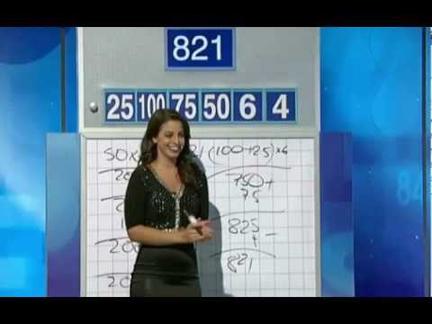

# Letters and Numbers - Number Game Solver

A generalised solver for the number game as featured on the pupular Australian game show 'Letters and Numbers'.

### The Problem

On she show, contestants are shown a target number (n < 1000), and given six numbers (n <= 100) with which they must combine using the basic algebraic operations (+, -, *, /), within a time limit.

The winner is the person who's answer is closest to the target.

Numbers cannot be used more than once, however it is not necassary to use all of the six smaller numbers.

### Usage

Clone this repo and run index.js using node, specifying the target number, followed by the numbers available to be combined. E.g:

bash
```
# Target: 467, allowed numbers: 100, 25, 7, 9, 2, 5
node index.js 467 100 25 7 9 2 5
```

This implemetation is general and will handle more (or less) numbers than are actually used on the show.

### Output

When a solution is found, it is printed to the console. Solutions are writtent in iterative notation, so `7-9+100*5-25+2` should be interpreted as `(((((7-9)+100)*5)-25)+2)`.

Finally, it will print the nuber of successful solutions.

If none are found, it will print the closest solution.

### Notes

This is a brute force solution and is not guarantee generate all possible answers within the time limit on the show. No attempt has been made to optimize this in any way.